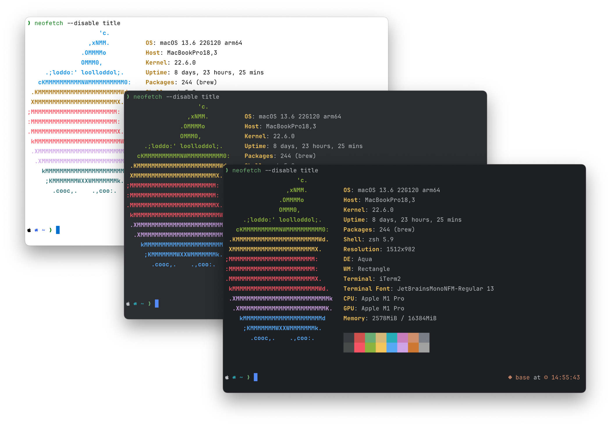

     
    
    <h3>JB for Terminals</h3>
    
 A set of colour schemes for Terminals, inspired by Jetbrains' IDEs.

Usage
---------------------------------------------------------------------------

Download the relevant configuration file for the desired colorscheme style
and terminal from the `colors/` directory. Update your terminal emulators'
preferences to use the new colorscheme file as the default.

Supported Terminals
---------------------------------------------------------------------------

- Iterm2 (files ending in .itermcolors)
- Kitty (files ending in .conf)

Related Projects
---------------------------------------------------------------------------

- JB colorschemes for vim: [vim-jb](https://github.com/devsjc/vim-jb)
